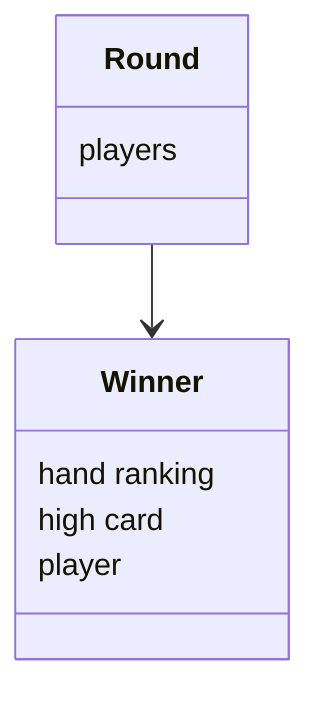

# Architectural description
## Structure
The structure of the project follows the architecture shown below:

## User Interface
There are 3 main windows in the application:
* Starting screen
* Game screen
* Ending screen

From the start screen, the user can start the game and will be brought to the game screen. From the game screen, the user can play the game and will be brought to the results screen. From the results screen, the user can start the game again and will be brought to the game screen.

## Application Logic
The main logical aspect of this project is used to calculate a winner. This is done by comparing the hands of each player, and determining which hand is the best. The hands are compared by first checking the hand ranking, and then checking the high card. If the hand ranking is the same, then the high card is used to determine the winner. 

## Main Functions
### Starting a game
The following diagram shows the flow of the game logic:

Once a player starts up the game, the game window is displayed. The player can then click the 'Start' button to start the game. The game is initialized, and the initial hand is dealt. The player can then select which cards to hold, and the new cards are dealt. The winner of the game is then determined, and the results are displayed. The player can then click the 'Start' button to play again.