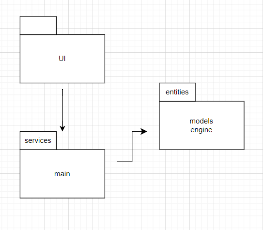
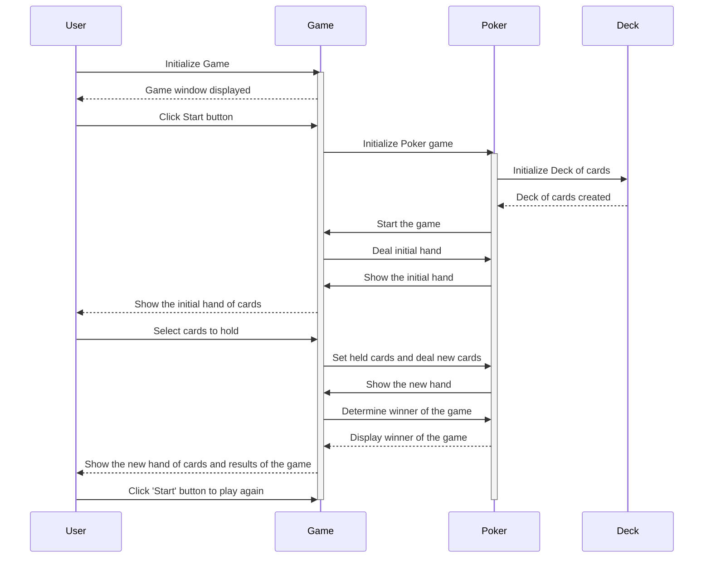

# Architectural description
## Structure
##### The structure of the project follows the architecture shown below:

## Application logic
The following diagram shows the flow of the application logic:
