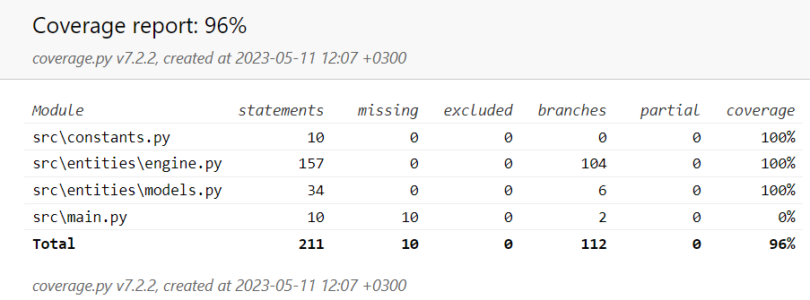

# Testing Report
The project has been tested for errors using Unittest.
## Testing Summary
There are 2 main files in this project that needed to be tested: the models.py file and the engine.py file. The models.py file contains the entities for a card and a deck of cards, while the engine.py file contained the entity for a poker game. 
#### Card
The tests for the card entity made sure that the card was equal to its string, and tested the __eq__ method of the card class. 
#### Deck
The tests for the deck entity made sure that the length of the deck was correct when initialized, and that the shuffle method of the deck class worked correctly. Additionally, the methods for drawing a card and dealing a hand to a player were tested for correctness.
#### Poker
The majority of the tests involved the poker game entity. Firstly, it checked to see that the game was initialized correctly, such that each player was dealt the correct number of cards. There was a multitude of tests done to check the correctness of the hand rankings, including making sure that the high card was calculated correctly as well. There was also a test done to check that the replace_cards method works correctly. Finally, there was a test done to check that the winner of the round was calculated correctly, as well as making sure that the score and player index was correctly converted to a string that contains the player and hand.
#### Miscellaneous
A single test was done to check that the constants were correct.

## Test results
The test results for the project can be viewed below:

In total, the coverage is 96%. However, this includes the main.py file that is used to start the game, which is the reason the coverage is not at 100%. All branches of the models.py and engine.py files were tested, and all tests passed. Additionally, the test for the constants.py file passed as well.