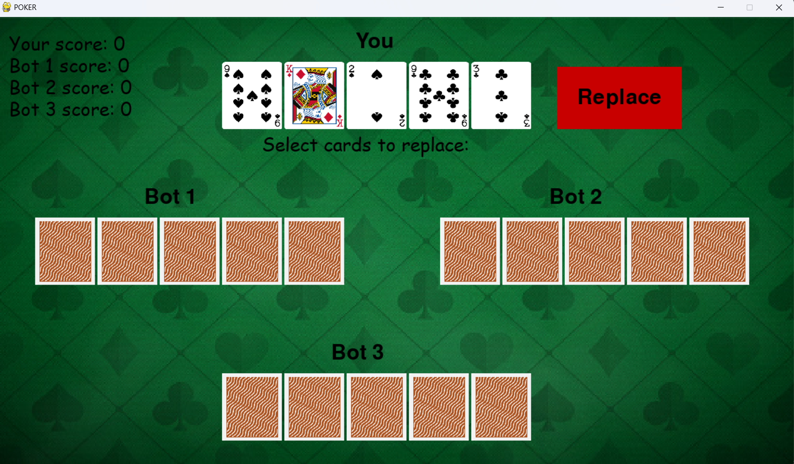

# User manual
## Introduction
This is the user manual for the project. It contains information about how to use the project and how to set it up.
## Installation
### Prerequisites
The project requires Python to run. The project also requires the following packages:
* Pygame
* Pytest
* Pylint

### Installing the project
The project can be installed by cloning the repository and installing the required packages. This can be done by running the following commands in the terminal:
```bash
git clone
cd poker
```
### Running the project
The project can be run by using Poetry and running the following command in the terminal:
```bash
poetry run invoke start
```
Poetry can be installed by running the following command in the terminal:
```bash
poetry install
```

## Using the project
### Starting the game
The start screen of the game looks like this:

The user can start the game by clicking the 'Start' button. The user can also quit the game by exiting the screen.

### Playing the game
The game screen looks like this:

The user can select cards to hold by clicking on them, and can deselect cards by clicking on them again. The user will be able to tell which cards have been held, as they are "raised". The user can then replace the cards by clicking the 'Replace' button, which will prompt the ending screen.

### Ending the game
The ending screen looks like this:

The user will now see the results of the game, and can choose to play again by clicking the 'New Round' button. On the top left part of the screen, the user can view the scores of each player. In this round, Bot 1 won with a three of a kind, which is shown on the screen.

