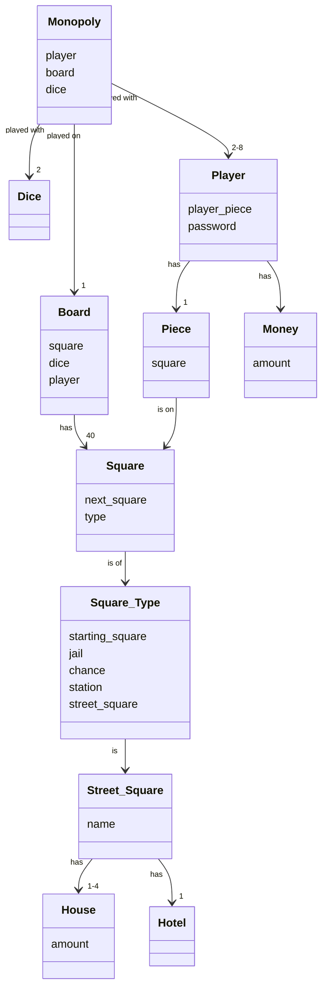

```mermaid
classDiagram
    Monopoly "played with" --> "2" Dice
    Monopoly "played on" --> "1" Board
    Monopoly "played with" --> "2-8" Player
    Board "has" --> "40" Square
    Piece "is on" --> Square
    Player "has" --> "1" Piece
    Player "has" --> Money
    Square "is of" --> Square_Type
    Square_Type "is" --> Street_Square
    Street_Square "has" --> "1-4" House
    Street_Square "has" --> "1" Hotel
        class Monopoly{
            player
            board
            dice
        }
        class Dice{

        }
        class Player{
            player_piece
            password
        }
        class Board{
            square
            dice
            player
        }
        class Square{
            next_square
            type
        }
        class Square_Type{
            starting_square
            jail
            chance
            station
            street_square
        }
        class Street_Square{
            name
        }
        class House{
            amount
        }
        class Hotel{

        }
        class Piece{
            square
        }
        class Money{
            amount
        }
```