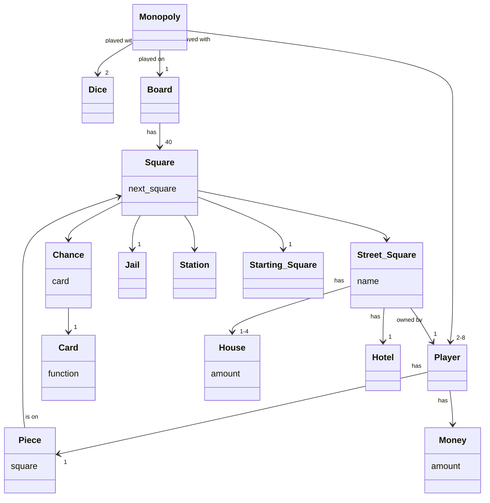

```mermaid
classDiagram
    Monopoly "played with" --> "2" Dice
    Monopoly "played on" --> "1" Board
    Monopoly "played with" --> "2-8" Player
    Board "has" --> "40" Square
    Piece "is on" --> Square
    Player "has" --> "1" Piece
    Player "has" --> Money
    Square --> Street_Square
    Square --> Chance
    Square --> "1" Jail
    Square --> Station
    Square --> "1" Starting_Square
    Chance --> "1" Card
    Street_Square "has" --> "1-4" House
    Street_Square "has" --> "1" Hotel
    Street_Square "owned by" --> "1" Player
        class Monopoly{
            
        }
        class Dice{

        }
        class Player{
           
        }
        class Board{

        }
        class Square{
            next_square
        }
        class Jail{

        }
        class Station{

        }
        class Starting_Square{

        }
        class Street_Square{
            name
        }
        class House{
            amount
        }
        class Hotel{

        }
        class Piece{
            square
        }
        class Money{
            amount
        }
        class Chance{
            card
        }
        class Card{
            function
        }
```