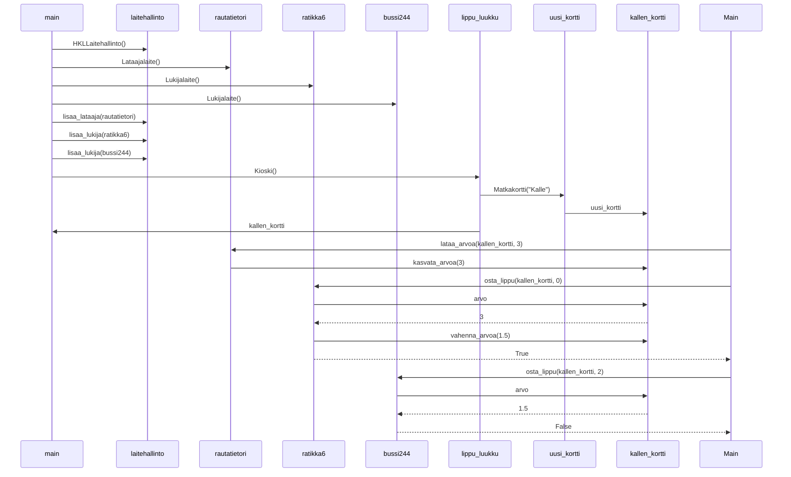

```mermaid
    sequenceDiagram
        main->>laitehallinto: HKLLaitehallinto()
        main->>rautatietori: Lataajalaite()
        main->>ratikka6: Lukijalaite()
        main->>bussi244: Lukijalaite()
        main->>laitehallinto: lisaa_lataaja(rautatietori)
        main->>laitehallinto: lisaa_lukija(ratikka6)
        main->>laitehallinto: lisaa_lukija(bussi244)
        main->>lippu_luukku: Kioski()
        lippu_luukku->>uusi_kortti: Matkakortti("Kalle")
        uusi_kortti->>kallen_kortti: uusi_kortti
        lippu_luukku->>main: kallen_kortti
        Main->>rautatietori: lataa_arvoa(kallen_kortti, 3)
        rautatietori->>kallen_kortti: kasvata_arvoa(3)
        Main->>ratikka6: osta_lippu(kallen_kortti, 0)
        ratikka6->>kallen_kortti: arvo
        kallen_kortti-->>ratikka6: 3
        ratikka6->>kallen_kortti: vahenna_arvoa(1.5)
        ratikka6-->>Main: True
        Main->>bussi244: osta_lippu(kallen_kortti, 2)
        bussi244->>kallen_kortti: arvo
        kallen_kortti-->>bussi244: 1.5
        bussi244-->>Main: False
        
```