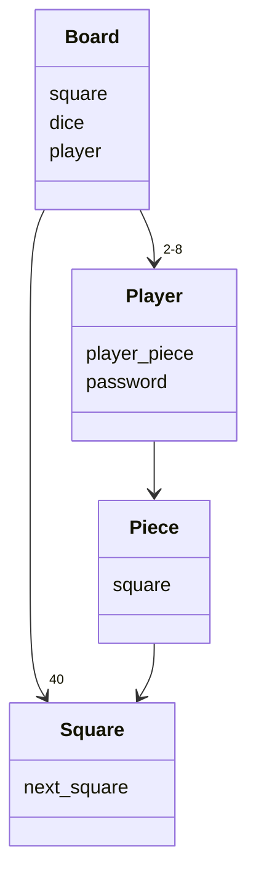

```mermaid
classDiagram
    Board --> "2-8" Player
    Board --> "40" Square
    Piece --> Square
    Player --> Piece
      class Player{
        player_piece
        password
      }
      class Board{
        square
        dice
        player
      }
      class Square{
        next_square
      }
      class Piece{
        square
      }
```