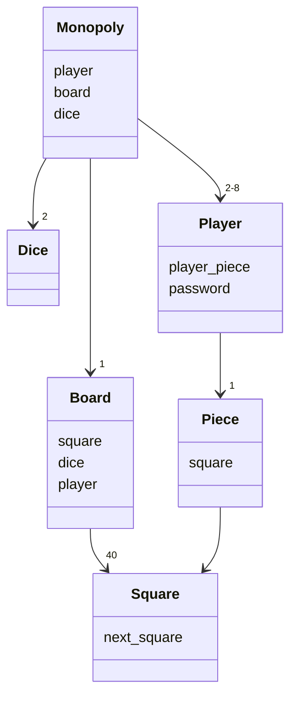

```mermaid
classDiagram
    Monopoly --> "2" Dice
    Monopoly --> "1" Board
    Monopoly --> "2-8" Player
    Board --> "40" Square
    Piece --> Square
    Player --> "1" Piece
        class Monopoly{
            player
            board
            dice
        }
        class Dice{

        }
        class Player{
            player_piece
            password
        }
        class Board{
            square
            dice
            player
        }
        class Square{
            next_square
        }
        class Piece{
            square
        }
```